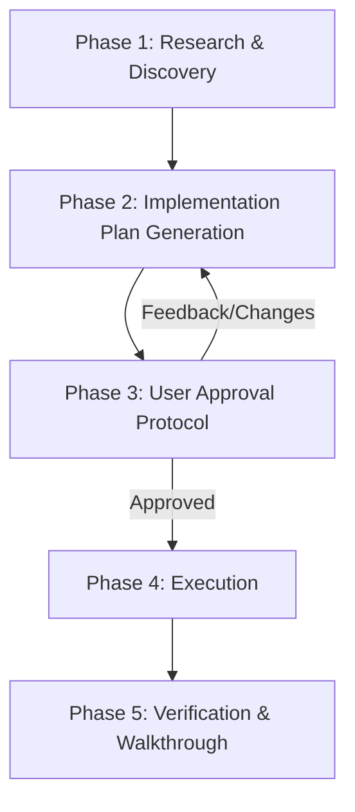

# Planned Mode Skill

This skill provides the official protocol for operating in **Planned Mode** within Google Antigravity. When a task involves architectural decisions, extensive code changes, high risk, or ambiguity, this skill enforces a disciplined plan-and-verify workflow before modifying code.

---

## When to Use Planned Mode

Activate Planned Mode whenever a task involves:
- **Major Architectural Changes**: Adding frameworks, changing core data structures, or altering system interfaces.
- **Complex Refactoring**: Multi-file modifications or broad dependency updates.
- **Significant Ambiguity**: Tasks where requirements need design decisions or trade-offs.
- **Explicit User Request**: When the user asks to "plan", "design first", or use Planned Mode.

*Do NOT use Planned Mode for simple one-off edits, single line fixes, quick log inspections, or simple Q&A.*

---

## The 5-Phase Planned Mode Workflow

### Phase 1: Research & Discovery
- **Read-Only Investigation**: Search codebase, view existing files, inspect dependencies, check configuration.
- **No Modifying Edits**: DO NOT edit source code or run destructive shell commands during research.
- **Understand Boundaries**: Identify all components affected by the requested changes.

### Phase 2: Implementation Plan Generation
- Create an `implementation_plan.md` artifact under `<appDataDir>/brain/<conversation-id>/implementation_plan.md`.
- Use the standard template: [references/plan_template.md](references/plan_template.md).
- Ensure `ArtifactMetadata` sets `RequestFeedback: true` and `UserFacing: true`.
- Document:
  - Goal Description
  - User Review Required (breaking changes, design choices)
  - Open Questions
  - Proposed Changes (grouped by component with `[NEW]`, `[MODIFY]`, `[DELETE]`)
  - Automated & Manual Verification Plan

### Phase 3: User Approval Protocol
- Present the implementation plan to the user.
- **STOP and wait for explicit user approval**.
- Do NOT proceed to execution until the user approves or automated policy approves the plan.
- If the user provides feedback or requests changes, update `implementation_plan.md` and re-submit for review.

### Phase 4: Executing Planned Changes
- Modify files step-by-step following the approved `implementation_plan.md`.
- Make targeted edits preserving code structure, docstrings, and comments.
- Validate each step incrementally. If unexpected issues arise, pause and update the plan.

### Phase 5: Verification & Walkthrough
- Execute automated tests, build checks, or manual verification steps outlined in the plan.
- Generate a `walkthrough.md` artifact under `<appDataDir>/brain/<conversation-id>/walkthrough.md`.
- Use the standard template: [references/walkthrough_template.md](references/walkthrough_template.md).
- Provide visual proof (screenshots, recordings, command output) demonstrating complete resolution.

---

## Best Practices & Rules

1. **Strict Approval Gate**: Never bypass Phase 3. Modifying source code prior to plan approval breaks Planned Mode integrity.
2. **Clear Basenames & Links**: Use standard Markdown file links (`[filename](file:///path)`) in plans and walkthroughs.
3. **Incremental Verification**: Verify each chunk of execution before declaring completion.
